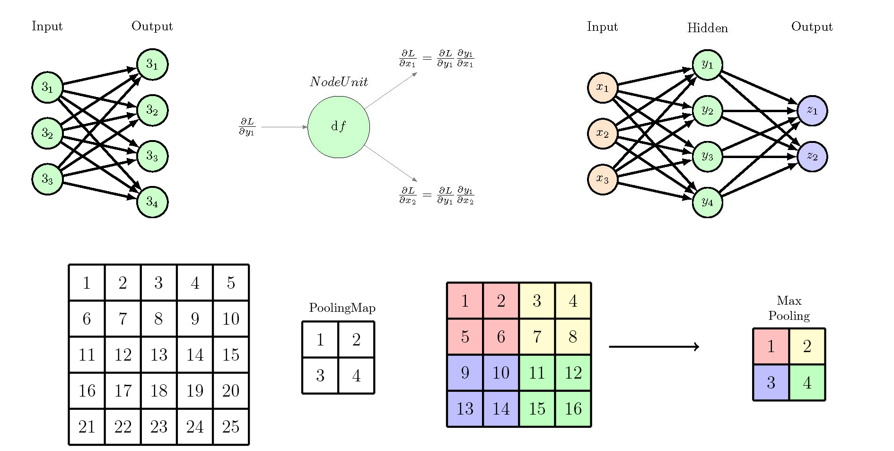

# Academic Plot Block
 Project of using simple python code snippets to plot academic figures.
<p align="center">
  
</p>
<p align="center">
    
    
    
</p>

## Usage

List of using steps:
- [x] Clone the repository
    ```bash
    git clone https://github.com/IvanMao714/Plot_Academic_Block.git
    ```
- [x] run neturalnetwork.py
  ```bash
    python neturalnetwork.py
   ```
- [x] generate the latex file and compile it
  ```bash
    pdflatex output.tex
   ```
  

## Contributor

<table>
  <tr >
    <td align="center"><a href="https://github.com/IvanMao714"><br /><sub><b>@IvanMao714</b></sub></a>
    <td align="center"><a href="https://github.com/FengD020508"><br /><sub><b>@FengD020508</b></sub></a>
  </tr>
</table>
