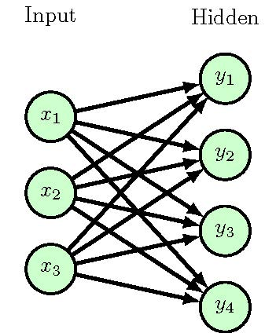

## Generate a Neural Network by Academic Plot Block

- 1.Import the necessary libraries
    ```python
    from diagram.NeuralNetwork.block.neurallinelayer import NeuralLineLayer
    from diagram.NeuralNetwork.block.neuralnodelayer import NeuralNodeLayer
    from diagram.NeuralNetwork.element.neural_node import NeuralNetworkNode
    from diagram.NeuralNetwork.element.neural_tittle import NeuralNetworkTittle
    from utils import generate_doc
    ```
- 2.Create a dictionary with the necessary parameters
    ```python
    nodes = [
        {'node_type': NeuralNetworkNode('I', 'black', 'green', 20, 'x'), 'number': 3,
         'text_content': 'Input', 'text_position': ["I1", "H1"]},
        {'node_type': NeuralNetworkNode('H', 'black', 'green', 20, 'y'), 'number': 4,
         'text_content': 'Hidden', 'text_position': ["H1", "H1"]},
    ]
    ```
- 3.Initialize the NeuralNetwork class
    ```python
    n = NeuralNodeLayer(nodes,0)
    ```
- 4.Generate the Latex File
    ```python
    generate_doc(n.generate())
    ```
You can get a diagram grenrated by the code above. The diagram is shown below:
<p align="center">
  
</p>
The detailed explanation of the `NeuralNetwork` class is shown in the [NeuralNetwork](./docs/NeuralNetwork.md) document.