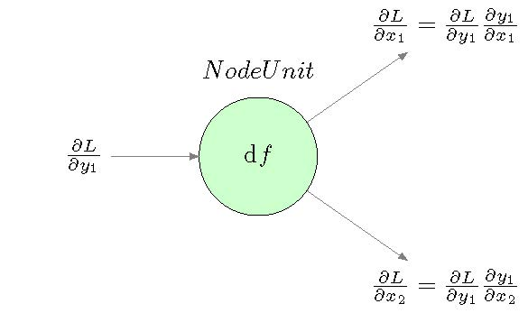

# Block Class

## NeuralUnit

The `NeuralUnit` class represents a unit in a neural network. It consists of nodes, lines and titles.

### Attributes
- `neural_node`: The nodes in the neural network.
- `neural_line`: A list of lines in the neural network.
- `neural_title`: The title of the neural network.

### Methods

#### def add_node(self, node):
Adds a node to the NeuralUnit. If the current node is not a list, it converts it to a list before adding.
- Parameters: node (`NeuralNetworkNode`): The node to be added.
- Returns: None

#### def add_line(self, line):
Adds a line to the NeuralUnit. If the current line is not a list, it converts it to a list before adding.
- Parameters: line (`NeuralNetworkLine`): The line to be added.
- Returns: None

#### def add_title(self, title):
Sets the title of the NeuralUnit.
- Parameters: title (`NeuralTittle`): The title of the NeuralUnit.
- Returns: None

#### def get_style(self):
 Returns the style of the NeuralUnit as a string. The style is a combination of the styles of the node, line and title.
- Parameters: None
- Returns: The style of the NeuralUnit as a string.

#### def draw(self):
Draws the NeuralUnit by adding pins to the node and returning the drawn node and title.
- Parameters: None
- Returns: The drawn node and title(Latex format).

##### Example:
```python
line_list = [NeuralLine('in', '\\frac{\partial L}{\partial y_1}', 'left', '35pt'),
                 NeuralLine('out', '\\frac{\partial L}{\partial x_1}=\\frac{\partial L}{\partial y_1}\\frac{\partial y_1}{\partial x_1}','above right', '35pt'),
                 NeuralLine('out', '\\frac{\partial L}{\partial x_2}=\\frac{\partial L}{\partial y_1}\\frac{\partial y_1}{\partial x_2}', 'below right', '35pt')]
nu = NeuralUnit(NeuralNode(0, 0, 'A', '\diff f'), line_list,
                    NeuralTittle('200pt', '4pt of A', 'centered', '2', 'Node Unit'))
generate_doc([nu])
```
