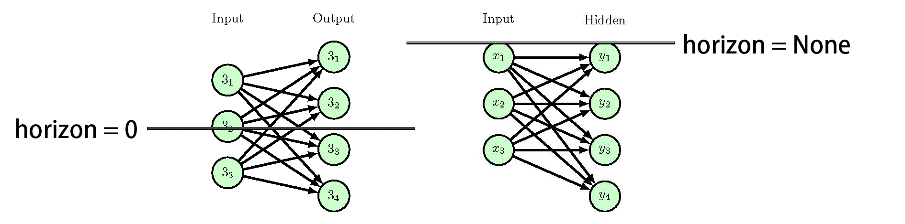

# Diagram Class

## NeuralNetwork

The `NeuralNetwork` class is used to generate a neural network diagram. The class is composed of the main methods: `generate` which is used to generate the diagram. The `NeuralNetwork` class is composed of the following attributes:

### Attributes
- `nodes`:  A directory of nodes in the neural network. 
- `horizon=None`: The horizon of the neural network. The horizon value is used to determine y-axis position of the nodes in the diagram. If the horizon is not specified, the nodes are placed on the top of the diagram. As below is the figure of horizon function.

### Methods
#### generate(self):
Generates the neural network diagram. 
- Parameters: None
- Returns: The list of nodes in the neural network diagram.
##### Example:
```python
nodes = [
    {'node_type': NeuralNetworkNode('I', 'black', 'green', 20, 'x'), 'number': 3,
     'text_content': 'Input', 'text_position': ["I1", "H1"]},
    {'node_type': NeuralNetworkNode('H', 'black', 'green', 20, 'y'), 'number': 4,
     'text_content': 'Hidden', 'text_position': ["H1", "H1"]},
]
nn = NeuralNetwork(nodes)
nn.generate()
```
The dictionary configuration also need `NeuralNetworkNode` class, you can see the document of  [NeuralNetworkNode](NeuralNetworkNode.md) here.